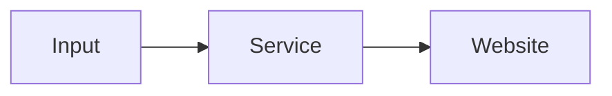

<div style="text-align:center"><img src="data:image/png;base64,iVBORw0KGgoAAAANSUhEUgAAAVsAAACRCAMAAABaFeu5AAAAwFBMVEX///8qXaNCQkMpW6VEbqwhWaEASp46Ojvj6PEXVJ8DT52KioqFhYWqutVmhbgmW6L4+fwATJwzMzSYq8w1Y6a3t7gaVKJXV1hPda/H0eOqqqvx9PnT2+m3w9pff7cASJ3Ly8vs7OwsLC6RpMmDmsTZ2dl5ksCktNNoaGje5O+wvti/yt/L1OWGnMUAP5pBaqwmJihycnOZmZrAwMDn5+etra1mhLlcXFxtbW7W1tafn5/Hx8hMTE0ZGRtui7oAO5jqDLEQAAAPnElEQVR4nO2df2OaOhfHsVAENi0pLtP5g1WtVNHarlvv3XYf7/t/V08SCAQ4gUjtvb0133+2aggnH5KTkxMQw/A/fq7q7taAdXsHlP7oS0qnunn69vjH57vHX19riy0suYYRcIDzDJQ8jPnX02FNhTUKlCxq0rNjGN+uL6rqfpa0/3MXKH39rQ7Z98eHa3ZUt3tdVzJGVx2prlBQPWLoAiXdXfrtOKypr0ZXaMsvTp1FTbqcGcYHiNbFhQQAdCEuuh9r0H54EE/QvX6SFexBpPIWe9UjBlDTL/vpt47Xkoo7TWuIai1q0NXgtdn6n8tHzD+0YtvxRpptUX9Va7+WlG5ge7nSbAt6hCqff2nDtlN1CmfN9mkO1v3wvRXbWLMVBNZMyt+1YXt50GxzPYGlieZQ+NzEtuoUzpkt6G3ZAVCs0MjWLTuFc2Y7l6CFq29kW3EKZ8z2u5ztA7BKbmRbcQpnzPZWznYORArNbMtOQbM9HdsMm2Z7U8P2pg3bjld0JWfM1pCFCWTdC5RWYJu1WrOVVE0OeGzHtuQUzpnt9wdZt/3Ujm0HFZxCO7ZXTbKF/G1FUpRlvXb+VrZ4gFyCEtuiU2jF1ts3bBjsF9kJlpWyl5ewYZVa90PnddlKZrPrH23ZXj6/lK1bTQMfpRkI192ChV81x/gb8grdP8CyKmyLTqENWzSGzq2uALQSwTuGr5sb/1SF2+3ChiixdTfCEWfO1vg9L9XfvQBiWyoltnSGyHTubI2bP0W63QfZdpka2wKbs2drGD8f59fXXbqDPr/4Jum0hipb0SlotkT+1x+/fv368Rvcy+FSY3s1zI/QbFWlxlaEo9mqSpGt4BQ0W1Upsr3MnYJmW5J/+wm+kU+RrUBHs8118/PHx7/m8+v/gXBV2bo9foRmy3Tz+9fjBQ3FaHkwDabMNncKmu33p29/Xs9JgJuVfxnbHM9Zs7399OGPeQHrKdi6/D7nM2XrU9f6ML8GK38h20srPeL82N58/fLx4uEaxnoKthmf/yjbrqTqeQPbL4/dqg84NVvuFNqw9d4A2w9fIUkKZ2zvanprS7YAv6t9e7aX/VGNGh6KOQ3bi+41JElZzla6+die7eUB2ERBTmu2nUvXq1Ej3FOwPUYZ21vZTaHt2bojAFHqFE6/h166AeKds/XG+yrB1Cm8AtsNZNn7ZQu1JnEKmu1L2ToIYBCcH9v56dk6htQpnBVb/0GpsiPZSp3CWbE1bh/vBM1Pw1bqFM6LbVE3stvBjmNrWIBTGJw5W+MXXPexbKF7NdH6zNl+geOGY9nKnIJm+3K2hlVd91KnoNmegC3kFLy1ZnsKtmPIKSw021OwNYaAU+hotidhC33nOcCCTbM9mi3oFAIg7v1PsG2VG381tpBT6Fit2F65NbIbd3xOsafz8elTVU8fG/Z0Xo0t+CX4QFID26vZVKrNtHkz7QRswaeUjOa9yNdiCzkFWG9/L/I0936cjq3k2aPj2b6BPfQ3x3ajfGeIZltVPVtf1SlotoDq2RrPik5BswXUwHaqegupZltVA1tVp6DZAmpga/TVnIJmC6iJraJT0GwBNbH11fIDmi2gJraKTkGzBdTINlZyCpotoEa2ak5BswXUyNaAbsXVbE/DNlbpuJotoGa2hqfwTgDNFpAC25WCU9BsASmwhe7PP5KtB//alLLeLVvDbXYKTftl7rBJ0OtlzoCtglNo3Oe9bNCVPTlLtqPm5cMJf+vyTbP9cWq2Ck7hXNjCW+7wz+SrsV02OoX3y/ZG1C/p+x2+5IWOY7ttBPZu2X57mAuS3w3Vzco8ZO8oUWLb7BTeK1vF53kLmvMXmqmxbXQK75Wt4rN7BWU/hqvGttEpaLYCWx40qLE1dL99Pba7BriabXu2kwZkmm17tk1OQbN9AdtF/bpXs30B2wanoNm+gK1RT+a9sv05b8H2uPjWaHIKb4kt/M7uvyRVA+/bFd7ZffO/49k+fE0PjoE3rFxdhVWrnfCy5o0t7jItNg6bX+8CCtW9XqPngYfAhW/uulVd/JRU/fMCKH2XJVyeoK/rlb8h/QBlqnuAERPLlae2rWxDLGrKgsNyqy9ZFtUHzn3V+PNMWlpaWlpaWlpaWlpaWlpaWlpaWlpaWlpaZyh/vZ1M1s1vaPl3NZNpWN1gfSParkwbUYXmsm7b8F+X9OfzwhOxdSzp03K9RYv6Rh2ETS6MzPgFtr2yTJnsk7D1d3YoYbsdhC3Y7kLG1POQ5zHG9uFlFr6ihBsYGNLsL3wSthibkt+PnN6b+Hi2gU1x7nebeBRvdh1E/vLeLtxcxGz66/MnFelaMrZeC7Zr0mvdTv5s3Yj13Ld/d4BP2dY9EthGJ2bbJ/UNxA/GzEO0NO6f03+BLfEBqPiw84Ra/aajBapXYwuHoW3YromJdukzi/TbXSvb/kEBbB3HIZ3OCVbLDe18fvK3+HXhCfxouVotehPh+7FLfXixmJHUFGETL8eFCifRjlSwkU+ia1RluwjtcJjVWmef4cfBcrUMKr183SPn3fUqc82IFY8rfWNbbmii8XSxouWBcVpl6/xt3wdGL8QYezRemt7boXAjmv+3bd9nfyxthKk8GwfpZ7ZNZ3UT2fbfpfORmmgAhW075LO8v0C8gr0sZh2H1aE1nmQ86+wjrTmEyQlQuBRxbTq2l5x3IJ53zBuEwkPB+l1qJ0ZoIdSztZJqCCqrcvUAtraJeyMWUJpelAzjZfEAL/3/mgb0rGpaNo3fXJcHy+UYN0ZZ9J/CGLEVQVqBPSsbl4oeMZAudQH78ps3g5DU7Cb1Yy/ro84A5ecVrszUzu3BYf4T7w5Oq2Ff53EVi7s5gErMDbMNKCvkYeo15WzHiJ7oEPSiHbPVZZ9alkVhkH8GJbajvbWnmCxrn/jKDTUNDXZRcGBXyYQBRgxEJFmN1LFdkSNdexb0giEdTHzV6dA/PHMZRUtKJYuVIxrs2UPSIGaPzYcinUBcu08+X+ypLfym5shOzE/Lo9JMArI1XdMbxpP40IdtT9muiPPkfW1qJ72cya06yFQxqSyzeCLGrQtSAd7DR+0TVzIMJgD8GrYbatQsuSYTesHT+pnPSnvlknrzxC3QwYrTjIpPL0uYuosFNt1heuoRyqZReioeZvs0UCwNVJit6eWXQM4WiUFmzzNdHoQqxmBCa4liagn8yyb+3ksTCWRxVp415Gx9lHufZJQhBivwxPXSMoue6dDJx3WQN0/oqoln86qNMciQRMV7siVshQ4kZTsm/xNcZIgG/NqqsZ2iYrEFFj1lUYuQp2rIrDFYiAbL2UaEYSf/JsCkE6fmecLrMkinCCfV4sbQTUeiHxbWLsjuDMe8wnwinN7jfWCIgtli4QLI2dL5O2cjUFJjS2wvxroe71iAxgvTxnyWxPY+X0vI2VpFhuP7/YE2no5qU6h65c6WlMCAFBcX0lvE+1hYyAtkLSNscT/72K+0GGZrC1Gf3CewdkIw1NhWMhlLXDhTWeveM7a9tP9mUZycLe1ukBlkfEDrDtpViisexD0onZzxphrx0l74LE/GwGzFoSlny+Zvz55F5XhaiS1dEhRdAJnoTMlsxrXerEwWJ5FJR25fUu0EFcc418wt9k9+dlTKWjAPypo2ZVMQnUuLh3TYGDJXkjebSHyC8HdNfDtjAatL4un+Rqxeie0IlUlOkFIGxomSLONOah/iX7hQyNyBV/kRvWRIlJk5iQNK51L03BMWfevQTaYAu7MDshuSuUz4u4ZtPsWQ6q3ctSmxrTa9fFXl2tj50kTKtofFaT8XhrOqQb6xkYtPPEHoJc7eJb4+D2Ycy+YAkL0qX7CXsTX8nhVyF4hMfklfnW3i6iKZfQnb6Di2NEwhy/Gi7jlHfzMM+baSh/PDJzts4+RzHJaeUXshW/pBvBukU4x3TAxGveuw8OUa9Amj1WxffbCu73JwUrYbcvGeARuw1CfglT8uSZjA/NFibyd8C61zen0v6b6oaKcaW+GYcZkt+zA+0KP49KvEtupd4blsY7tudUoiAz7t9SW244xt1aEnoqEZEN2QS2HKMhqZ/HiFXLM6HtaRhYRFdVpYia1Q1RoBbGlFLIuQ/F+JLYVQLLUAB/GkFBMm6mWxZenaT7LwoxzwGLvDojdOlupikO9YyygWD6yXP3TBgjTOwIV1ZTPbuOgX6eVN2I6i1V44ktoWJv9Vi28HxTUKm8Ax8CQv9YP98ockkEoBxcWh38tXd7i0X2FifO8kLbBEmxBGtP7KXoa1Cui1MCbRUkwgOmmnGG8WfdGprcpxczNbyszN/xyanO3Bxp5w/cf59kD9vgM/P5uYhe9iVE1LUrG1cCnRQDtzmHTmbXGZRYdPynZZWDdl8S5bJAgDYZiGWjTbIjKPELkWtBk7MluVPDptnn+PsWgvXaYV1pnNbNnSNvNPPZSxpf7MyxHSDpNeRrOwGBYlDmB6amE0j2n/hOYenyZq7MKCjfJ0h4J9Wbdi9qVsnYLlzM+yS1SEOOKug6blhBzVOMv0MK8kvBXBSxcZdOwI3mhfXrI3s6XHmFjIBGb+li5L9pwh7RU84UaOkOyKUSiYH0LXdYg72Ell/s1bzzLQ3iLta/5oJoS3zLeYPCpasCCfe0Oa4sr22p8xH39jlkv0c4vSUbGiA4Rfw7VgDx0LHQ53jXnCaxuKOVt6dHFuVmDLVnx2fzOa7mgk18/YbllqexmvnfWUxgnZMrTPEt0WEEU67JD9IHHgfY9m7RdbZx33GS7JT1f3wnRVtH/uzwaIztRC2cS+wzS171mYaWjiFw03a2cSuDS/mjY0poljxM77LNpNi2M3oJ+zuIfnb+kNEqa9og2NV0KembbTG0QTx5lEA5yXV2dr9Fne30MktsPI2eEsTuglHQrZiMa3KBtncbIjhIBV+yBZ3qQXeGUnSxp2PJbvN29xksAly6LkeM8Urttzap9H7RuTzprP4kPmwhALS90w8xwxXaySa4XoagvlMzVbxHN73BxVXGiol20wDZPyCLGwNyxNCv69590X2ZJPSkFWlK69sD0cEx5eyL+YDHjij5xAmNd2IcYuRlC2yUTYdfF9OqBHg3TRiL3iXmFZkcmXPzR/UYx1shUpDmdjMsXm9lG/g/iqSbxH0xmmhhNgYl0bnBZ3SV1i5mCfNdSzBXcX8MQcXQtXusZmOi3kWUhoMZ2WO5y/We3NzozlpLebqZAUnQQHq2MOZrvicHCi1WG1AJOx8WJ1WAbZKSfB877TGS6nTffVrnvLGXX91qGcjkrtG8yYRy7aR863Gw7MwXNQclBOdCBNspblpm4X1B7rEJU29dfRwRpUG0pWpTNSfn+I0vr/D4BOICpuefplAAAAAElFTkSuQmCC" alt="hinet" style="width:300px;"/>

<h2 style="color:#2a5da3;">KIẾN TRÚC CƠ SỞ DỮ LIỆU </br>
<b>Đánh giá hiệu quả dịch vụ công trực tuyến</b></h2>
</div>

### 1. Thống kê về dịch vụ

Một trang web có nhiều dịch vụ công. Mỗi dịch vụ công là một biểu mẫu (form). Trong mỗi form có nhiều trường nhập thông tin (input), và chỉ duy nhất một nút gửi (submit). Dịch vụ công được ghi nhận hoàn thành thành công khi và chỉ khi thông tin được cơ sở dữ liệu (database) chấp nhận và lưu trữ ngay sau khi người dùng submit. Ghi nhận thất bại khi người dùng đã ấn submit trên trình duyệt nhưng thông tin không được chấp nhận vì bất cứ lý do gì.

Như vậy định danh cho mỗi dịch vụ công là ID nút submit. Đo lường hiệu quả mỗi dịch vụ thông qua các thống kê: lượt submit thành công/thất bại, lượt điền form, lượt xem thuần túy, thời gian ở trong dịch vụ.


```sql
CREATE TABLE Service_ {
	id_submit VARCHAR(255),
	task VARCHAR(255),
	success INT,
	fail INT,
	fill INT,
	visit INT,
	time_onsite INT,
	stamp DATETIME,
	PRIMARY KEY (id_submit),
};
```
> Sau khi điền đầy đủ thông tin vào form `Đăng ký kết hôn`, người dùng ấn nút submit id=`581f0d47`, đã có tổng cộng `835`/`234` lượt sử dụng dịch vụ thành công/thất bại, `1420` lượt điền form mà không submit, `2035` lượt xem thuần túy không điền form cũng không submit, tổng cộng thời gian xem form là `580212` giây (không phân biệt các trường hợp success/fail/fill/visit), tính từ `2022-11-30 13:00:00` và trong 1 giờ tiếp theo.
```sql
INSERT INTO Service_ VALUES
('581f0d47', 'Đăng ký kết hôn', 835, 234, 1420, 2035, 580212, 2022-11-30 13:30:00);
```
---
### 2. Thống kê về trường thông tin


Đi vào chi tiết cụ thể hơn, tìm hiểu nguyên nhân làm cho sử dụng dịch vụ khó khăn/thất bại bằng cách thống kê trên các trường input.

```sql
CREATE TABLE Input {
	id_input VARCHAR(255),
	id_submit VARCHAR(255),
	title_input VARCHAR(255),
	success INT,
	fail INT,
	stamp DATETIME,
	PRIMARY KEY (id_input),
	FOREIGN KEY (id_submit) REFERENCES Submit(id_submit),
};
```
> Ô thông tin `Địa chỉ` có id=`ca2ffe58` nằm trong dịch vụ `Đăng ký kết hôn`. Trong số `234` lượt `Đăng ký kết hôn` thất bại, `56` lượt có nguyên nhân đến từ ô `Địa chỉ` bị điền sai, tính từ `2022-11-30 13:00:00` và trong 1 giờ tiếp theo.
```sql
INSERT INTO Input VALUES
('ca2ffe58', '581f0d47', 'Địa chỉ', 56, 2022-11-30 13:30:00);
```

----

### 3. Thống kê về trang web


Thống kê này cho ta cái nhìn tổng quát về trang web

```sql
CREATE TABLE Website {
	success INT,
	fail INT,
	fill INT,
	visit INT,
	time_onsite INT,
	stamp DATETIME,
}
```
> Đã có `10`/`24` lượt sử dụng dịch vụ thành công/thất bại, `36` lượt điền form mà không submit, `124` lượt xem trang thuần túy, tổng cộng thời gian xem trang web là `58212` giây (không phân biệt các trường hợp success/fail/fill/visit), tính từ `2022-11-30 13:00:00` và trong 1 tuần tiếp theo.
```sql
INSERT INTO Website VALUES
('217.76.56.249', 10, 24, 36, 124, 58212, 2022-11-30 13:30:00);
```

Như vậy ta đã đi qua nghiên cứu 3 cấp thống kê giao diện của trang web dịch vụ công: thống kê trường thông tin làm cơ sở cho thống kê luồng dịch vụ, thống kê về luồng dịch vụ làm cơ sở cho thống kê về tổng thể trang web.


Dưới đây sẽ tiếp tục nghiên cứu thống kê về hạ tầng, là những thứ đứng sau trang web, người dùng không thể thấy

---

### 4. Thống kê về server

Hiện nay vấn đề quá tải server không còn đáng lo vì đã có những công cụ giúp tự động mở rộng thuê thêm máy chủ khi tải cao, và tự động thu lại khi tải thấp, cùng với các công cụ cân bằng tải, bộ nhớ đệm...
Để có cơ sở trình các cấp lãnh đạo lựa chọn công nghệ phù hợp và dự trù kinh phí tương ứng, ta cần có các thống kê về server và database.

```sql
CREATE TABLE Server {
	stamp DATETIME,
	users INT,
	cpu FLOAT,
	ram FLOAT,
	get_ INT,
	put_ INT,
	post_ INT,
	delete_ INT,
	get_respone FLOAT,
	put_respone FLOAT,
	post_respone FLOAT,
	delete_respone FLOAT,
};
```
> Đã có 264 người truy cập vào trang web, tiêu thụ 34% CPU và 21% RAM, tổng cộng `56`/`531`/`775`/`12` lượt GET/PUT/POST/DELETE từ khối Frontend gửi đến khối Backend, thời gian phản hồi trung bình tương ứng của server là `243.2`/`231.1`/`241.4`/`204.6`, đơn vị milisecond, tính từ `2022-11-30 13:00:00` và trong 1 giờ tiếp theo.
```sql
INSERT INTO Infrastructure VALUES
(2022-11-30 13:30:00, 264, 0.34, 0.21,
56, 531, 775, 12, 243.2, 231.1, 241.4, 204.6);
```

---

### 5. Thống kê về database

```sql
CREATE TABLE Warehouse {
	id VARCHAR(255),
	name_ VARCHAR(255),
	create_ INT,
	read_ INT,
	update_ INT,
	delete_ INT,
	create_respone FLOAT,
	read_respone FLOAT,
	update_respone FLOAT,
	delete_respone FLOAT,
	stamp DATETIME,
	PRIMARY KEY (id),
}
```
> Bảng `Danh bạ điện thoại` trong Database với id=`be4e3eec`, tổng cộng `56`/`531`/`775`/`12` lượt Create/Read/Update/Delete (CRUD) từ khối Backend gửi đến khối Database, thời gian phản hồi trung bình tương ứng của Database là `243.2`/`231.1`/`241.4`/`204.6`, đơn vị milisecond, tính từ `2022-11-30 13:00:00` và trong 1 giờ tiếp theo.
```sql
INSERT INTO Warehouse VALUES
('be4e3eec', 'Danh bạ điện thoại', 56, 531, 775, 12, 243.2, 231.1, 241.4, 204.6)
```

---
### 6. Thống kê heatmap

Về phần Heatmap như Quyết đã trình bày. Tuy nhiên lưu ý một số điểm sau:
- Heatmap là tổng cộng tích lũy của tất cả session
- Heatmap trực quan với người dùng nhưng không thân thiện với máy tính
- Heatmap không thể làm đầu vào cho các bước tính toán tiếp theo, chỉ dùng mắt thường xem heatmap để đoán hành vi người dùng
- Heatmap liên hệ chặt chẽ với cây HTML
- Đầu ra của heatmap là file ảnh jpeg, nó screenshot trang web rồi tô màu lên
